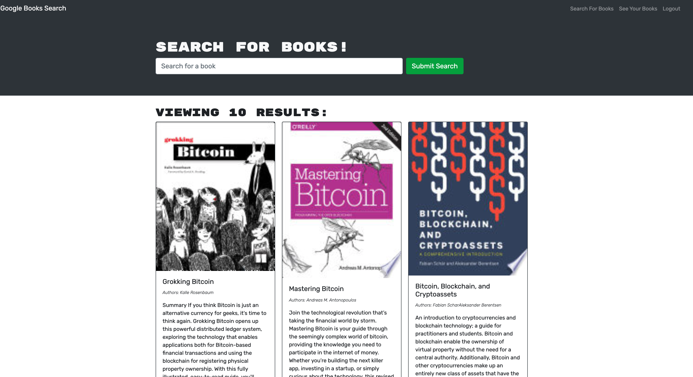
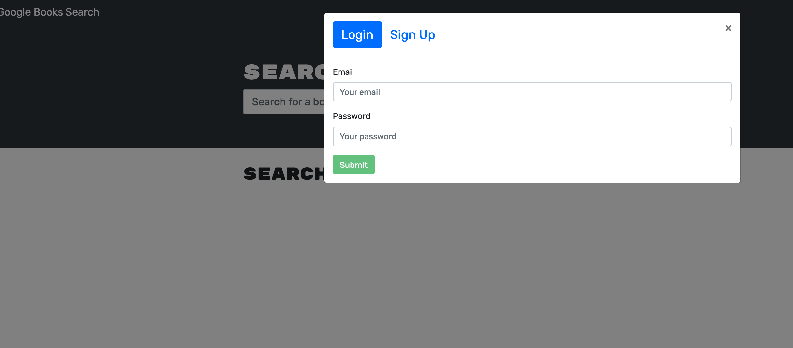

# the-book-search

## [Heroku Deployed App Url](https://book-search-999.herokuapp.com/)

## [GitHub Url](https://github.com/harry-100/book-search)

## Description

This app is a full stack web application that allows users to search and save books using Google search API. It uses MERN stack and REST API calls. The codebase has been refactored to use GraphQL and Apollo for making API calls instead of REST API.

## Table of Contents

* [Usage](#Usage)
* [License](#License)
* [ScreenShots](#ScreenShots)
* [Questions](#Questions)

## Usage
This app is deployed on heroku. It can be invoked by clicking on the url provided above. 

## License
This application is covered under [MIT](
      https://opensource.org/licenses/MIT
      ) license.

## ScreenShots

## Questions
If you need more information, please checkout my [github account](https://github.com/harry-100). You can also reach me via [email](mailto:harvinder.shah@gmail.com?subject=book-search).
